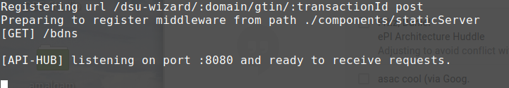
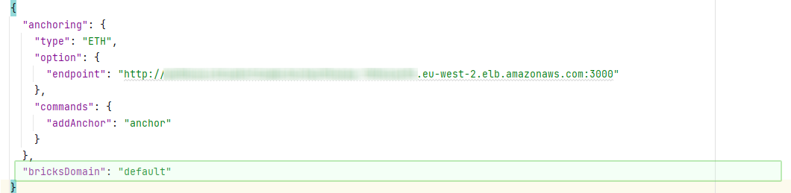

[](https://github.com/pharmaledgerassoc/epi-workspace/actions/workflows/tests.yml)
[](https://github.com/pharmaledgerassoc/epi-workspace/actions/workflows/test-build-processes.yml)
# epi-workspace

*epi-workspace*  bundles all the necessary dependencies for building and running EPI SSApps in a single package.

For more details about what a *workspace* is check out the [template-workspace](https://github.com/PrivateSky/template-workspace).

## Table of contents
1. [Installation](#installation)    
   1. [Clone the workspace](#step-1-clone-the-workspace)
   2. [Launch the "server"](#step-2-launch-the-server)
   3. [Build all things needed for the application to run](#step-3-build-all-things-needed-for-the-application-to-run)
2. [Running](#running)
    1. [Demiurge wallet](#demiurge-wallet)
        1. [Admin authorization flow](#admin-authorization-flow)
        2. [Enterprise wallet user authorization flow](#enterprise-wallet-user-authorization-flow)
    3. [Enterprise wallet](#enterprise-wallet)
        1. [Register new account details](#step-1-register-new-account-details) 
        2. [Authorization process](#step-2-authorization-process)
3. [Prepare & release a new stable version of the workspace](#prepare--release-a-new-stable-version-of-the-workspace)        
4. [Build Android APK](#build-android-apk)
5. [Build iOS ipa](#build-ios-ipa)
6. [Configuring ApiHub for Messages Mapping Engine Middleware](#configuring-apihub-for-messages-mapping-engine-middleware)
    1. [Configuring Domain for ApiHub Mapping Engine usage](#configuring-domain-for-apihub-mapping-engine-usage)
    2. [Testing ApiHub Mapping Engine](#testing-apihub-mapping-engine)
7. [DFM reporting functionality](#dfm-reporting-functionality)
8. [ACF SSApps instalation and test](#acf-ssapps-instalation-and-test)
9. [BDNS conventions](#bdns-conventions)
10. [Migration](#migration)


## Installation

In order to use the workspace, we need to follow a list of steps presented below.

### Step 0: Check specific instructions/configurations for a particular setup.

Installation will default to use single sign-on.  
~~For a single-sign-on setup on a developer's laptop, please see the private annex documents on Jira PDMONB-6.~~

~~The remaining instructions are generic.~~

### Step 1: Clone the workspace

```sh
$ git clone https://github.com/pharmaledgerassoc/epi-workspace.git  
   
   or   
     
$ git clone https://github.com/pdmfcsa/epi-workspace.git
```   
After you cloned the repository was cloned, you must export the environment variable for the github repositories.   

```sh   
$ export GITHUB_ORGANIZATION=PharmaledgerAssoc 

    or 

$ export GITHUB_ORGANIZATION=PDMFCSA 
```
<span style="color:red">Note: If you switch terminals you have to redo the previous step.</span>

Add a file called .ssotoken to the project root with the sso client secret.

While in the *epi-workspace* folder run:
```sh    
$ echo "Client Secret" > .ssotoken
$ echo "browserstack secret" > .browserstack
```


Install all the dependencies.
While in the *epi-workspace* folder run:
```sh
# To use a stable version   
$ npm install   

   or

# To use the latest code
$ npm run dev-install
```
**Note:** this command might take quite some time depending on your internet connection and you machine processing power.

### Step 2: Launch the "server"/ Build all things needed for the application to run.

launch the couchdb instance:

```shell
cd opendsu-sdk && npm run start-db
```

While in the *epi-workspace* folder:

 - If it is the first time you are running the application:

```sh
$ npm run build-all
```
 - After the first time always run this command:
```sh
$ npm run server
```

At the end of this command you get something similar to:




### ~~Step 3: Build all things needed for the application to run.~~ (Deprecated)

~~Open a new console inside *epi-workspace* folder and run:~~
(Deprecated)
```sh
# Note: Run this in a new console inside "epi-workspace" folder
$ npm run build-all (Deprecated)
```

## Running 
To run the application launch your browser (preferably Chrome) in Incognito mode and access the http://localhost:8080 link.

### Demiurge wallet
Demiurge is intended to be a management platform. Important flows include the user authorization flow for the Enterprise Wallet users.
Once a user create an Enterprise wallet he gets authorized to use the features only after an admin Demiurge user adds the enterprise wallet DID into the ePI write group.

#### Admin authorization flow
The first Demiurge wallet will be the "super admin". This first user will be able to make other users admin by adding them into the ePI admin group.
1. As Demiurge admin open your Demiurge wallet
2. Navigate to the Groups page
3. Select ePI admin group
4. Input the user DID that needs admin priviledges
5. Click add button.

#### Enterprise wallet user authorization flow
1. As Demiurge admin open your Demiurge wallet
2. Navigate to the Groups page
3. Select ePI write group
4. Input the user DID that needs to be authorized to used the Enterprise wallet
5. Click add button.

### Enterprise wallet

Enterprise wallet allows creation of Products and Batches.

#### Step 1: Register new account details

With the sso enabled you woun't need to input any data.


#### Step 2: Authorization process
Once the Enterprise wallet opens will prompt a message to share your DID information with an admin in order get authorized and gain access to the features.


Now you will be able to add Products (and leaflets for it) and create Batches of products and other ePI cool features.


### EPI Client
This is the part a normal user will see. The part that will
be used to scan barcodes on drug's packages.

## Prepare & release a new stable version of the workspace
Steps:
1. start from a fresh install of the workspace.
```
git clone https://github.com/pharmaledgerassoc/epi-workspace
cd epi-workspace
```
2. ensure that env variable called DEV is set to true in env.json file
>{
>  "PSK_TMP_WORKING_DIR": "tmp",
>  "PSK_CONFIG_LOCATION": "../apihub-root/external-volume/config",
>  **"DEV": true**
>}
3. run the installation process of the workspace
```
npm install
```
4. run the server and build the ssapps and wallets
```
npm run server
npm run build-all
```
4. verify that the builds are successfully and the ssapps are functioning properly
5. execute the freeze command
```
npm run freeze
```
6. verify the output of freeze command and check for errors. If any, correct them and run again the freeze command.
7. commit the new version of the octopus.json file obtained with the freeze command.


### Testing via port forward

```shell
aws eks --region eu-west-1 update-kubeconfig --name <env>-<mah>
kubectl get pods # <== get the id of the pod to port forward to
kubectl port-forward <id> 8080:8080 # <== use the id from previous command
```

### Configuring Domain for ApiHub Mapping Engine usage

1. Find the domain configuration in ```/apihub-root/external-volume/config/domains/<domainName.json>```
and modify or add the ```bricksDomain``` property with wallet subdomain value.   

3. Restart the server. 
Now the ApiHub Mapping Engine is configured for processing messages from external sources through ```/mappingEngine/:domainName"``` endpoint via the **PUT** HTTP verb.

### Testing

During the install process you should have a file under `tests/config/test.config.json` holding the default test settings.


## BDNS conventions

### Company Sandbox – (Unconnected Blockchain - a single cluster or multiple clusters)

Domain: sandbox.epi.companyShortName  
 
Subdomain: sandbox.epi.companyShortName 
 
Vault: sandbox.vault.companyShortName  


### Developer Sandbox – (No Blockchain/Unconnected Blockchain - a single cluster or multiple clusters)

Domain: sandbox.epi.companyShortName

Subdomain: sandbox.epi.companyShortName

Vault: sandbox.vault.companyShortName  


### Company Dev – (Connected Blockchain)

Domain: dev.epi  
 
Subdomain: dev.epi.companyShortName
 
Vault: dev.vault.companyShortName  


### Company QA – (Connected Blockchain)

Domain: qa.epi

Subdomain: qa.epi.companyShortName

Vault: qa.vault.companyShortName 


### Company Prod – (Connected Blockchain)
 
Domain: epi  

Subdomain: epi.companyShortName

Vault: vault.companyShortName  


### PLA Demo – (Unconnected Blockchain - 4 Clusters)

Domain: demo.epi.pla

Subdomain: demo.epi.pla

Vault: demo.vault.pla 


### PLA Quality – (cted Blockchain)

Domain: quality.epi.pla 

Subdomain: quality.epi.pla 

Vault: quality.vault.pla 


### Leaflet Schema validation
The XSD template file is located in ./tests/resources/leaflet-schema.xsd

To validate a leaflet file, just run the command
```sh
$ npm run schema-validation -- pathToFile
```

## Migration

Migration covers moving an existing SOR environment to a new release or infrastructure (for example a new cluster or a new OpenDSU version). The workspace ships with dedicated test suites that validate data integrity around a migration:

- `tests/migration/before-migration.test.js` - creates reference records (TRUST-125) on the source environment before the migration
- `tests/migration/after-migration.test.js` - verifies the same records on the target environment after the migration

To make the before/after comparison meaningful, the environment should be populated with a **known, controlled dataset** and a **manifest** describing every record, so the records can be compared afterwards.

### Populating the environment

The script `bin/populate-controlled.js` fills the SOR with a deterministic, reproducible dataset and writes a manifest describing exactly what was created. Reruns are idempotent: existing products/batches are reused and already-uploaded leaflets are skipped.

**Prerequisites**

1. The server must be running (CouchDB + `npm run server`, see [Installation](#installation)).
2. `tests/config/test.config.json` must point to the target environment (`sor_endpoint`, OAuth `clientId`/`clientSecret`/`scope`, `domain`, `subdomain`).

**Steps**

1. (Optional but recommended) Generate and validate the plan without sending anything to the SOR:

```sh
$ node ./bin/populate-controlled.js --dry-run
```

2. Populate the environment:

```sh
$ node ./bin/populate-controlled.js
```

The full default dataset (100 products) uploads roughly 1,700 records and takes some minutes. A run summary is printed at the end; the full log is written to `workdocs/populate-run.log` when redirecting the output.

**Options**

| Option | Default | Description |
|---|---|---|
| `--products <n>` | `100` | Number of products to generate |
| `--seed <n>` | `2026` | Seed for the deterministic dataset - the same seed always generates the same dataset |
| `--leaflets-dir <path>` | completLeaflet example folder | Folder with the leaflet XML (and its images) used as leaflet content |
| `--manifest <path>` | `workdocs/populate-manifest.json` | Where the dataset manifest is written |
| `--dry-run` | off | Generate, validate and write the manifest without contacting the SOR |

**What the dataset contains**

- 100 products (configurable), each with 2-3 languages (`en` + `fr` always, a 3rd language randomly), 1-3 batches, 0-3 strengths and 0-2 markets (some products intentionally have no market)
- Product-level leaflets covering every scenario: `{leaflet, prescribingInfo} x {no market, each product market}` for every language
- Batch-level leaflets: type `leaflet` only, no market, 2-3 different languages per batch
- 2-3 update rounds (PUT) per product and per batch that change property values, creating version history and `Updated Product`/`Updated Batch` audit entries; the manifest records every round and the expected final state (`finalFields`/`finalStrengths`)
- Some products have a product photo and/or extra images attached to their leaflets
- Every optional product/batch/market property is filled randomly, so all combinations appear across the dataset

**Comparing records after the migration**

- `workdocs/populate-manifest.json` contains the full plan (every product with its GTIN, fields, strengths, markets, batches and leaflets) plus the execution result of the run (per record: `added`/`skipped`/`failed`). Use it as the baseline to compare the records before and after the migration.
- The same `--seed` regenerates the identical dataset; GTINs depend on the local `.gtin-counter.lock` state and are recorded in the manifest, which is the authoritative GTIN <-> product mapping.
- If the migration wipes the environment, delete `.gtin-counter.lock` and rerun the script with the same `--seed` to reproduce the exact same dataset (fresh GTINs - use the manifest of the previous run to map old GTINs to new ones).
